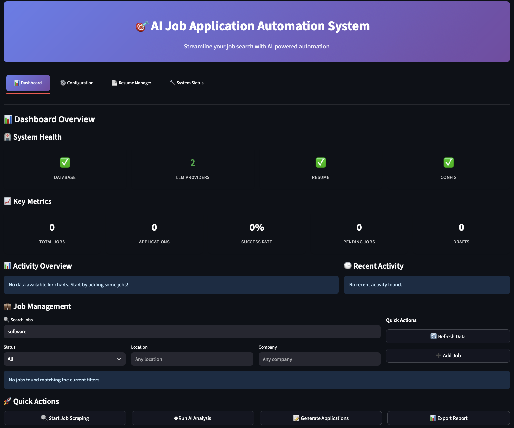

# AI Job Application Preparation Tool

A comprehensive Python-based system that automates job application preparation using AI, while maintaining ethical standards through manual review and approval workflows.

## 📸 Dashboard Preview



*The Streamlit dashboard provides a comprehensive overview of your job application pipeline with system health monitoring, key metrics, activity charts, job management, and quick actions - all in a professional dark theme interface.*

## 🎯 What It Does

This tool **prepares** everything you need for job applications but **doesn't automatically submit** them:

✅ **Scrapes & Filters**: LinkedIn RSS feeds → AI-filtered relevant jobs  
✅ **Customizes**: AI-tailored resumes for each position  
✅ **Researches**: Contact information for hiring managers  
✅ **Generates**: Personalized email drafts  
✅ **Exports**: Everything ready for manual review and sending  

❌ **Does NOT**: Automatically submit applications or send emails

## 🏗️ Architecture

- **Dual LLM Backend**: OpenRouter API + Local Qwen 3 32B support
- **Semi-Automated Workflow**: Batch processing with manual approval gates
- **Streamlit UI**: Professional dashboard for review and management
- **SQLite Database**: Local data storage and application tracking
- **Ethical Design**: Respects terms of service and requires human oversight

## 🚀 Quick Start

### Prerequisites

- Python 3.12+
- UV package manager
- Optional: Ollama for local LLM support

### Installation

```bash
# Clone and setup
git clone <repository-url>
cd ai-job-automation

# Install dependencies
uv sync

# Setup environment
cp .env.example .env
# Edit .env with your API keys and preferences

# Run the application
uv run streamlit run src/ui/dashboard.py
```

### Configuration

1. **Choose LLM Backend**:
   - **OpenRouter API**: Add `OPENROUTER_API_KEY` to `.env`
   - **Local Qwen 3**: Install Ollama and set `USE_LOCAL_LLM=true`

2. **Optional APIs** (for better contact discovery):
   - Hunter.io API key
   - Apollo.io API key

3. **User Information**: Update your details in `.env`

## 📋 Usage Workflow

1. **Configure Settings**: Set up your preferences and API keys
2. **Add LinkedIn URLs**: Paste job search RSS feed URLs
3. **Run Batch Process**: Let AI filter and process jobs
4. **Review Results**: Approve/reject filtered jobs in the UI
5. **Customize Resumes**: Review and edit AI-generated resumes
6. **Preview Emails**: Check personalized outreach emails
7. **Export Package**: Download everything for manual sending

## 🛠️ Technical Stack

- **Backend**: Python 3.12, AsyncIO, SQLite
- **AI/LLM**: OpenRouter API, Ollama, OpenAI-compatible APIs
- **UI**: Streamlit with custom components
- **Scraping**: BeautifulSoup4, Feedparser, Requests
- **Documents**: Markdown, HTML, PDF generation
- **Data**: Pandas, SQLite, JSON

## 📁 Project Structure

```
ai-job-automation/
├── src/
│   ├── config/          # Configuration management
│   ├── scrapers/        # LinkedIn RSS and job scraping
│   ├── ai_processing/   # LLM integration and AI workflows
│   ├── contact_finder/  # Email discovery and validation
│   ├── email_composer/  # Email generation and templates
│   ├── document_manager/# Resume and document handling
│   ├── ui/             # Streamlit dashboard and interfaces
│   └── utils/          # Logging, rate limiting, utilities
├── data/
│   ├── templates/      # Resume and email templates
│   ├── exports/        # Generated documents and emails
│   └── logs/          # Application logs
├── tests/             # Unit and integration tests
└── docs/              # Additional documentation
```

## 🔧 Features

### Core Automation
- **LinkedIn RSS Scraping**: Respectful job data collection
- **AI Job Filtering**: Smart relevance detection
- **Resume Customization**: Job-specific tailoring
- **Contact Discovery**: Multi-tier email finding
- **Email Generation**: Personalized outreach templates

### User Interface
- **Dashboard**: Overview of all activities and metrics
- **Job Manager**: Review and approve filtered positions
- **Resume Editor**: Live preview and editing
- **Email Preview**: Review before export
- **Settings Panel**: Configure all aspects of the system

### Data Management
- **Application Tracking**: Complete history and status
- **Export System**: Organized packages for each application
- **Backup & Recovery**: Data persistence and error handling
- **Analytics**: Success rates and performance metrics

## 🔒 Security & Ethics

- **API Key Security**: Encrypted storage and masked display
- **Rate Limiting**: Respectful API usage
- **Terms Compliance**: Designed to respect website policies
- **Manual Oversight**: Human approval required for all actions
- **Data Privacy**: Local storage, no external data sharing

## 🧪 Testing

```bash
# Run all tests
uv run pytest

# Run specific test categories
uv run pytest tests/test_scrapers.py
uv run pytest tests/test_ai_processing.py
```

## 📚 Documentation

- [Setup Guide](docs/setup.md) - Detailed installation instructions
- [User Manual](docs/user_guide.md) - Complete usage walkthrough
- [API Reference](docs/api.md) - Developer documentation
- [Troubleshooting](docs/troubleshooting.md) - Common issues and solutions

## 🤝 Contributing

1. Fork the repository
2. Create a feature branch
3. Make your changes
4. Add tests for new functionality
5. Submit a pull request

## ⚖️ Legal & Ethical Considerations

This tool is designed to **assist** with job applications, not replace human judgment:

- **Manual Review Required**: All outputs must be reviewed before use
- **Respect Terms of Service**: Use responsibly and within platform guidelines
- **Quality Over Quantity**: Focus on relevant, high-quality applications
- **Professional Standards**: Maintain authenticity in all communications

## 📄 License

MIT License - see [LICENSE](LICENSE) file for details.

## 🆘 Support

- **Issues**: Report bugs via GitHub Issues
- **Discussions**: Join community discussions
- **Documentation**: Check the docs/ directory
- **Email**: Contact for enterprise support

---

**Built with ❤️ for job seekers who want to work smarter, not harder.**